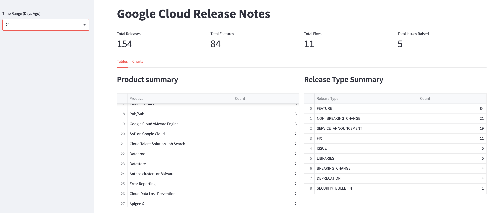
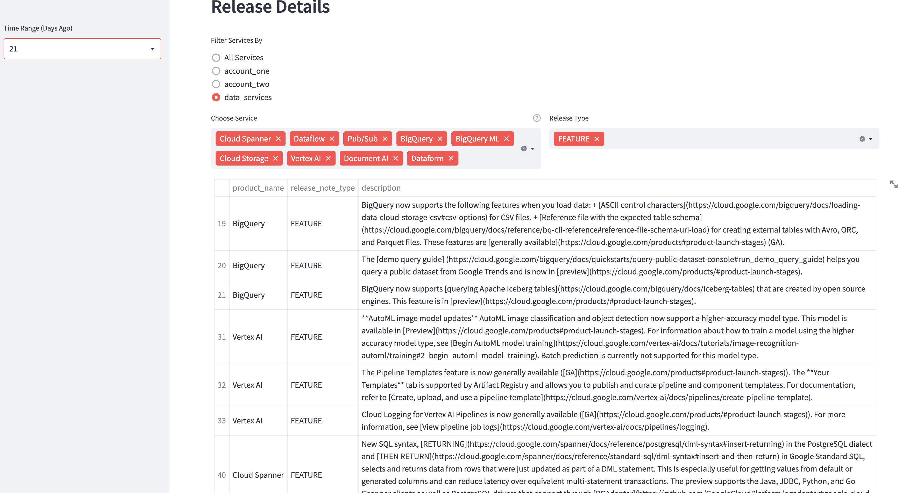

# GCP Release Announcements App

### Problem does the app solve
This app can be used to stay up to date will all the new GCP releases notes/features.
Users are able to configure this app using the config.yaml file to group and categorise specific service they are interested in.

### Time Range Picker
The time range picker allows the user to configure how far back in time they would liek to view the release notes

### Release Summary 
The first part of the app capture summary of all release over the given time period including the Product category and Release type


### Specific Services 
The second section allow the user customise and group certain services for easy viewing.
In this example, and the default configuration for this app is to have four sections with the data service being shown in the image below.




# Deployment

##  How to Run locally 

- Create Service Account with Big Query read access
- Download the Service Account JSON key locally

- Clone the repository
- Setup Virtual environment
```
$ python3 -m venv env
```
- Activate the virtual environment
```
$ source env/bin/activate
```
- Install dependencies using
```
$ pip install -r requirements.txt
```
- Set Environment Variables
```shell
export PATH_TO_PRIVATE_KEY = <PATH TO JSON FILE>
export PROJECT_ID = <PROJECT_ID>
export CONFIG_FILE = <PATH TO CONFIG_FILE>
```
- OR Update Environment Variables default Values in app.py
```shell
export PATH_TO_PRIVATE_KEY = <PATH TO JSON FILE>
export PROJECT_ID = <PROJECT_ID>
export CONFIG_FILE = <PATH TO CONFIG_FILE>
```
- Set Project Root Directory
```
gcp-release-notes-app
eg. /Users/xxx/PycharmProjects/gcp-release-notes-app/
```

- Run Streamlit (from the project root directory)
```
$ streamlit run app.py
```


# Cloud Run Hello World Sample - NOT COMPLETE

This sample shows how to deploy a Hello World application to Cloud Run.

export GOOGLE_CLOUD_PROJECT=<PROJECT_ID>

export PATH_TO_PRIVATE_KEY = <PATH TO JSON FILE>

gcloud config set project PROJECT_ID

gcloud config set run/region REGION


## Build

```
docker build --tag helloworld:python .
```

## Run Locally

```
docker run --rm -p 9090:8080 -e PORT=8080 helloworld:python
```

# Build and deploy

Command to build the application. PLease remeber to change the project name and application name
```
gcloud builds submit --tag gcr.io/<ProjectName>/<AppName>  --project=<ProjectName>
```

Command to deploy the application
```
gcloud run deploy --image gcr.io/<ProjectName>/<AppName> --platform managed  --project=<ProjectName> --allow-unauthenticated
```

## Deploy

```sh
# Set an environment variable with your GCP Project ID


# Submit a build using Google Cloud Build
gcloud builds submit --tag gcr.io/${GOOGLE_CLOUD_PROJECT}/helloworld

# Deploy to Cloud Run
gcloud run deploy helloworld \
--image gcr.io/${GOOGLE_CLOUD_PROJECT}/helloworld
```


For more details on how to work with this sample read the [Python Cloud Run Samples README](https://github.com/GoogleCloudPlatform/python-docs-samples/tree/main/run)
